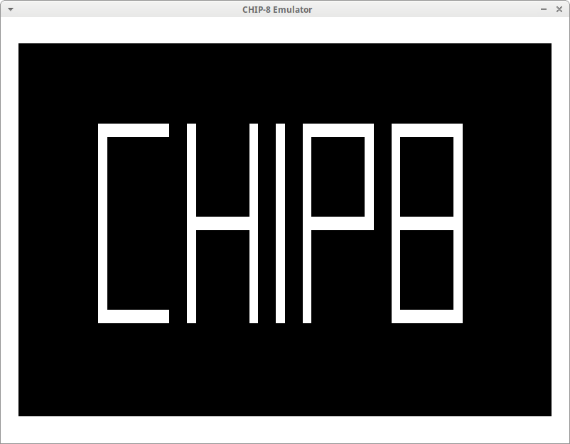

# chip8-emulator

Minimal emulation of CHIP8 programs using SDL & C++.

## Building and Running

```bash
# Prerequisite dependencies (on Ubuntu/Debian/etc)
sudo apt install git build-essential pkg-config cmake cmake-data libsdl2-dev libsdl2-image-dev

# Building
mkdir build
cd build
cmake ..
make

# Running
./chip8-emulator "Some path to a valid CHIP8 program"
```

## Example



The chip8-emulator running the "CHIP8 PICTURE" demo.

## Contributing
Pull requests are welcome. For major changes, please open an issue first to discuss what you would like to change.

Please make sure to update tests as appropriate.

## License
[MIT](https://choosealicense.com/licenses/mit/)
